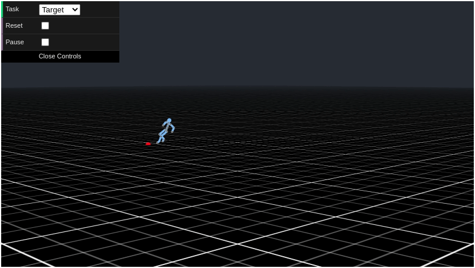

# Motion VAEs WebGL Demo

This repo contains the source code for the [Motion VAE WebGL demo](https://www.cs.ubc.ca/~hyuling/projects/mvae/).

<p align="center">
    
</p>

## Quick Start

To run the demo locally, simply start a web server in the project folder.

```bash
git clone https://github.com/belinghy/MotionVAEs-WebGL.git
cd MotionVAEs-WebGL
python -m http.server
```

Make sure your browser supports WebGL, then go to `http://localhost:8000/` or wherever the server is pointed to.

The web server is to bypass the CORS problem, since modern web browsers do not allow accessing of the user's filesystem.

### Controls

- Place target: Ctrl-click
- Change joystick direction: Ctrl-click or WASD
- Clicking reset in the GUI will reset the character to the centre

## Citation

If you found our research useful, please cite the following paper.

```bibtex
@article{2020-TOG-MVAE,
  author    = {Hung Yu Ling and Fabio Zinno and George Cheng and Michiel van de Panne},
  title     = {Character Controllers Using Motion VAEs},
  journal   = {ACM Transactions on Graphics (Proceedings of ACM SIGGRAPH)},
  publisher = {ACM},
  volume    = {39},
  number    = {4},
  year      = {2020}
}
```
